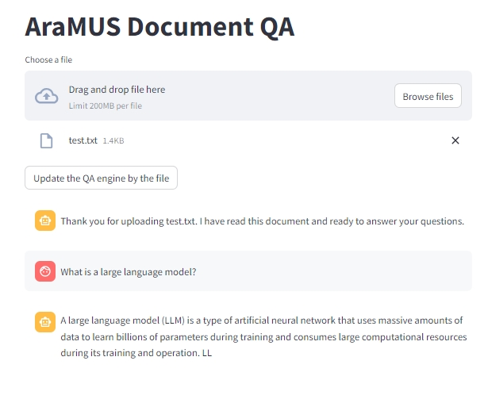

# qa_from_doc

the service is online http://37.224.68.132:27326/

you can upload a .txt file, click the button "Update the QA engine by the file" and then ask a question

the system will search the file and generate the answers from the file.

